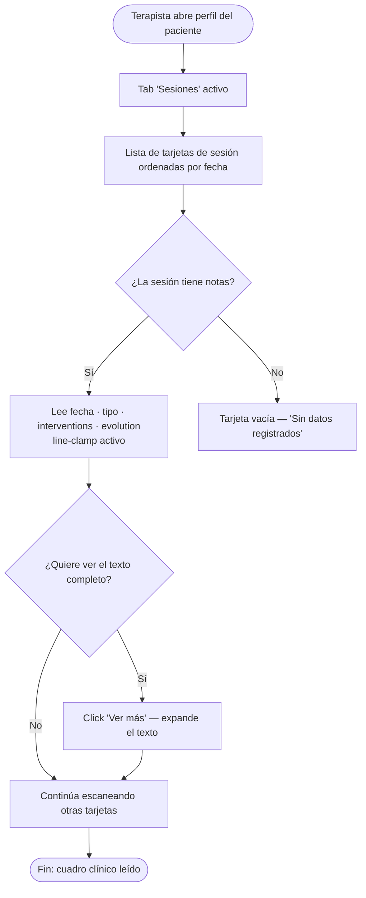
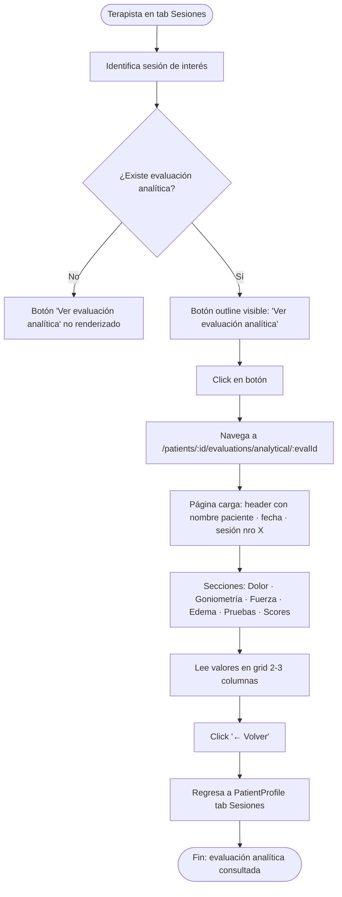
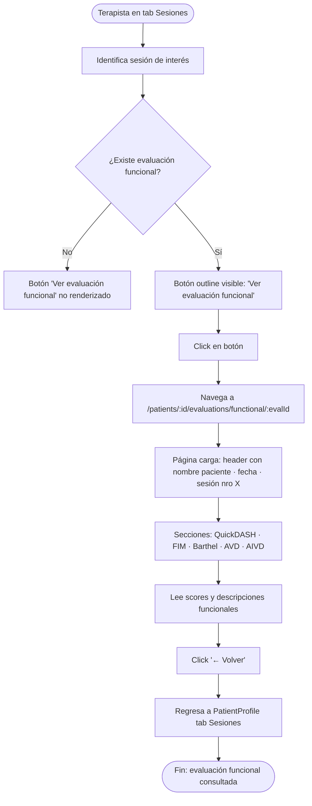

# UX Design Specification ProyectiTO

**Author:** Jose
**Date:** 2026-05-06

---

<!-- UX design content will be appended sequentially through collaborative workflow steps -->

## Executive Summary

### Project Vision

ProyectiTO es una aplicación web de gestión clínica para terapistas ocupacionales que cubre el ciclo completo de un paciente: admisión → sesiones → evaluaciones → alta. El objetivo es eliminar el trabajo manual de documentación clínica y dar a la terapeuta una vista clara del progreso de cada paciente.

### Target Users

Terapistas ocupacionales en consultorios o centros de rehabilitación. Trabajan con pacientes con patologías musculoesqueléticas (fracturas, cirugías de mano, etc.). Su flujo de trabajo es denso en datos clínicos y requieren acceso rápido a la información sin fricciones.

### Key Design Challenges

- **Densidad de información**: las sesiones contienen datos clínicos + evaluaciones analíticas + evaluaciones funcionales — todo junto genera ruido visual.
- **Acceso contextual**: la terapeuta necesita ver evaluaciones específicas sin perder el contexto de la sesión.
- **Flujo de navegación**: separar resumen clínico de evaluaciones sin fragmentar demasiado la experiencia.

### Design Opportunities

- Tarjetas de sesión más limpias con acceso progresivo a detalle (resumen → evaluación).
- Páginas de evaluación dedicadas con datos organizados de forma legible y comparable.
- Reducir la carga cognitiva mostrando solo lo relevante en cada nivel de navegación.

## Core User Experience

### Defining Experience

La terapista revisa el historial de sesiones de un paciente necesitando separar las notas clínicas narrativas de los datos de evaluación numéricos. La mejora clave: tarjetas de sesión limpias con acceso progresivo al detalle de evaluaciones vía página dedicada.

### Platform Strategy

Web desktop/tablet. Mouse y teclado principalmente. Sin requerimientos offline. Pantallas mínimas de 768px (tablet en consultorio).

### Effortless Interactions

- Leer el resumen clínico de una sesión sin que los datos numéricos interfieran visualmente
- Acceder a la evaluación de una sesión con un click
- Volver al perfil del paciente sin perder la posición en el historial

### Critical Success Moments

- La tarjeta de sesión muestra solo lo relevante → la terapista lee más rápido
- Los botones de evaluación aparecen solo si hay datos → sin ruido visual
- La página de evaluación organiza datos densos (goniometría, edema, scores) de forma legible

### Experience Principles

1. **Progresividad**: mostrar el resumen primero, el detalle bajo demanda
2. **Señalización clara**: los botones de evaluación solo aparecen si hay datos
3. **Contexto preservado**: navegación con back claro al perfil del paciente
4. **Densidad con orden**: la página de evaluación organiza datos complejos en secciones, no en una lista plana

### Design Decision

**Opción B — Página dedicada** para ver evaluaciones desde sesiones.
Rutas: `/patients/:id/evaluations/analytical/:evalId` y `/patients/:id/evaluations/functional/:evalId`

**Relación evaluación↔sesión:** FK directa — `analytical_evaluations.session_id` y `functional_evaluations.session_id` referencian `therapy_sessions.id`. Los botones se habilitan si existe una fila con ese `session_id`.

## Desired Emotional Response

### Primary Emotional Goals

**Eficiencia tranquila.** La terapista abre una sesión, lee lo que necesita rápido, llega a la evaluación en un click y vuelve. Sin fricción, sin buscar dónde está la info. No se busca deleite ni sorpresa — se busca control y ausencia de trabajo extra.

### Emotional Journey Mapping

- Al ver la tarjeta de sesión → **claridad** (sé exactamente qué hay acá)
- Al ver el botón de evaluación → **confianza** (hay datos cargados, puedo acceder)
- Al ver la página de evaluación → **control** (los datos están organizados, puedo leerlos)
- Al volver al perfil → **continuidad** (no perdí mi lugar)

### Micro-Emotions

- **Confianza vs. confusión** → el diseño señaliza qué hay y qué no (botones solo cuando hay datos)
- **Eficiencia vs. frustración** → mínimo de clicks para llegar al dato
- **Profesionalismo vs. informalidad** → la página de evaluación se ve como un documento clínico real

### Design Implications

- Botones de evaluación visibles solo si hay datos → elimina ansiedad de "¿habrá algo acá?"
- Back claro al perfil del paciente → elimina frustración de navegación
- Tarjeta de sesión sin datos de evaluación → elimina saturación visual
- Página de evaluación con secciones claras → refuerza sensación de instrumento profesional

### Emotional Design Principles

1. **Control sobre deleite**: priorizar que la terapista sienta que está a cargo, no que el sistema la sorprende
2. **Señalización honesta**: nunca mostrar elementos vacíos o botones que no llevan a nada
3. **Continuidad de contexto**: cada navegación debe tener un camino claro de vuelta
4. **Apariencia clínica**: la densidad de datos es esperada y válida; organizarla bien es el objetivo

## UX Pattern Analysis & Inspiration

### Inspiring Products Analysis

Sin referencias específicas del usuario. Inspiración basada en patrones estándar para herramientas clínicas (EHR/HIS), apps de gestión estructurada (Linear, Jira) y dashboards de laboratorio médico.

**Herramientas clínicas:** usan master-detail universal — tarjeta de resumen para escanear, página dedicada para el detalle. Los profesionales de salud necesitan revisar múltiples registros rápido.

**Apps de gestión estructurada:** items en lista con metadata resumida → click a página completa. El item en lista nunca muestra todo, solo lo suficiente para decidir si entrar.

**Dashboards de laboratorio:** resultados agrupados por categoría con valores numéricos en columnas alineadas. Hace legible la densidad sin abrumar.

### Transferable UX Patterns

**Navegación:**
- Master-detail con back explícito: lista de sesiones → página de evaluación con botón "← Volver a sesiones"
- Tabs dentro de la página de evaluación si eventualmente se ven analítica y funcional juntas

**Tarjeta de sesión:**
- Jerarquía: fecha + tipo arriba, contenido clínico al medio, acciones al pie
- Chips/badges para indicar presencia de evaluaciones ("Eval. analítica ✓") — más compacto que botones grandes
- line-clamp en textos largos con "Ver más" opcional

**Página de evaluación:**
- Secciones con títulos claros: Dolor, Goniometría, Fuerza, Edema, Pruebas específicas
- Grid de 2-3 columnas para datos numéricos — más fácil de escanear que lista vertical
- Unidad siempre explícita (°, kg, cm)
- "No registrado" en gris claro, no en negro

### Anti-Patterns to Avoid

- ❌ Tabla horizontal con scroll lateral para goniometría → pierde contexto de columnas en tablet
- ❌ Accordion colapsado por defecto → agrega click innecesario
- ❌ Modal para la evaluación → datos de goniometría no caben bien
- ❌ Botón "Ver evaluación" visible aunque no haya datos → genera confusión

### Design Inspiration Strategy

**Adoptar:** master-detail navigation con back claro · grid 2-3 col para datos numéricos · jerarquía visual en tarjeta

**Adaptar:** badge de presencia (chip pequeño) en lugar de botón grande · secciones de evaluación basadas en campos reales de la DB

**Evitar:** scroll horizontal · accordions cerrados por defecto · botones que llevan a páginas vacías

## Design System Foundation

### Design System Choice

**Shadcn/ui + Radix UI + Tailwind CSS** — ya instalado y en uso en toda la app. Decisión preexistente, no requiere cambio.

### Rationale for Selection

El proyecto usa `@/components/ui/` con Card, Button, Badge, Dialog, Skeleton, etc. La regla explícita del project-context prohíbe instalar librerías UI adicionales. El sistema actual cubre todos los componentes necesarios para esta feature.

### Implementation Approach

- Tarjetas de sesión → `Card` + `CardContent` (patrón existente en el tab Sesiones)
- Indicadores de evaluación → `Badge` de Shadcn
- Página de evaluación → `Card` por sección + grid Tailwind para datos numéricos
- Navegación → `useNavigate()` de React Router + `Button variant="ghost"` para back

### Customization Strategy

Sin customización nueva. Usar tokens semánticos existentes (`bg-card`, `text-muted-foreground`, `border-border`) y componentes disponibles en `@/components/ui/`. No hardcodear colores Tailwind.

## 2. Core User Experience

### 2.1 Defining Experience

> "Revisar el historial de sesiones de un paciente y acceder a cualquier evaluación en un click, sin perder el contexto."

La terapista necesita separar notas clínicas narrativas de datos de medición numéricos — igual que en papel, donde la hoja de sesión y la hoja de evaluación son documentos distintos.

### 2.2 User Mental Model

La terapista trabaja con documentos separados en papel: hoja de sesión (notas subjetivas) y hoja de evaluación (mediciones objetivas). La app debe replicar esa separación natural. Mezclar ambos en la misma tarjeta rompe ese modelo mental.

### 2.3 Success Criteria

- La tarjeta de sesión no muestra datos de evaluación — solo botones de acceso si hay datos
- El badge de evaluación aparece/desaparece según FK en DB — cero ruido visual
- La página de evaluación es legible sin scroll excesivo — datos en grid por sección
- El back regresa exactamente al tab Sesiones del perfil del paciente

### 2.4 Novel UX Patterns

Ninguno. Todo el flujo usa patrones establecidos: master-detail, navegación con back, badges de estado. No requiere educación al usuario.

### 2.5 Experience Mechanics

```
1. INICIO
   Tab "Sesiones" en PatientProfile → lista de tarjetas de sesión

2. ESCANEO
   Tarjeta: fecha · tipo · nro de sesión
   + interventions, evolution, AVD, observaciones (line-clamp)
   + Badge "Eval. analítica" y/o "Eval. funcional" solo si hay FK

3. ACCIÓN
   Click en badge → navega a página dedicada
   /patients/:patientId/evaluations/analytical/:evalId
   /patients/:patientId/evaluations/functional/:evalId

4. DETALLE
   Secciones: Dolor · Goniometría · Fuerza · Edema · Pruebas · Scores
   Header: nombre paciente · fecha evaluación · sesión nro X

5. RETORNO
   Botón "← Volver" → PatientProfile tab Sesiones

6. COMPLETUD
   Terapista leyó clínica + vio números → cuadro completo del paciente
```

## Visual Design Foundation

### Color System

Tokens semánticos Tailwind ya establecidos — sin paleta nueva:

| Rol | Token | Uso |
|---|---|---|
| Superficie card | `bg-card` | Tarjeta sesión, secciones evaluación |
| Texto principal | `text-foreground` | Datos clínicos, valores numéricos |
| Texto secundario | `text-muted-foreground` | Fechas, labels, "No registrado" |
| Borde | `border-border` / `border-border/50` | Cards, separadores |
| Acento | `text-primary` / `bg-primary` | Badges de evaluación disponible |
| Fondo | `bg-background` | Página de evaluación |

### Typography System

- `font-sans` (Inter) → contenido clínico y datos numéricos
- `font-serif` (Playfair Display) → títulos de sección en página de evaluación (apariencia de documento clínico)
- Escala: `text-sm` datos densos · `text-xs` metadata/labels · `text-base` títulos de sección
- "No registrado" → `text-muted-foreground text-sm`

### Spacing & Layout Foundation

- Base 4px (Tailwind estándar)
- Tarjeta de sesión: `p-4` interior · `space-y-2` entre tarjetas
- Página de evaluación: `space-y-6` entre secciones · `grid-cols-2 sm:grid-cols-3 gap-3` para datos numéricos
- Densidad compacta: `text-sm` y `p-3` predominantes

### Accessibility Considerations

- Contraste garantizado por tokens semánticos Shadcn/Tailwind
- Badges como refuerzo visual — texto de acción siempre legible independientemente del color
- "No registrado" en `text-muted-foreground` nunca como único indicador — acompañar con ausencia del campo

## Design Direction Decision

### Design Directions Explored

Se exploraron 4 variaciones de tarjeta de sesión (A–D) y 2 variaciones de página de evaluación (1–2), presentadas en `ux-design-directions.html`.

### Chosen Direction

**Tarjeta de sesión — Variación B (Botones outlined al pie)**
Botones `variant="outline"` al pie de la tarjeta: "Ver evaluación analítica" y "Ver evaluación funcional". Solo visibles si existe la FK correspondiente en base de datos. Visibilidad explícita, sin ambigüedad sobre la acción disponible.

**Página de evaluación — Variación 1 (Grid de datos)**
Grilla 2–3 columnas por sección (Dolor, Goniometría, Fuerza, Edema, Pruebas, Scores). Valores numéricos con unidad explícita, prominentes. "No registrado" en `text-muted-foreground`. Sin scroll horizontal.

### Design Rationale

Los botones outlined son más explícitos que badges o dots para una herramienta clínica donde la claridad de acción es prioritaria sobre la compacidad visual. El grid de datos organiza información densa de forma escaneable sin requerir scroll lateral, alineado con el objetivo de "apariencia de documento clínico".

### Implementation Approach

- `Card` + `CardContent` con `CardFooter` para los botones de evaluación
- `Button variant="outline" size="sm"` con ícono (ClipboardList o similar)
- Render condicional: botón visible solo si `session.analytical_evaluation_id != null`
- Página de evaluación: secciones como `Card` independientes + `grid grid-cols-2 sm:grid-cols-3 gap-3`
- Rutas: `/patients/:patientId/evaluations/analytical/:evalId` y `/patients/:patientId/evaluations/functional/:evalId`

## User Journey Flows

### Journey 1: Revisar historial de sesiones

La terapista entra al perfil del paciente para leer el resumen clínico de sus sesiones recientes.



### Journey 2: Acceder a evaluación analítica desde una sesión



### Journey 3: Acceder a evaluación funcional desde una sesión



### Journey Patterns

**Navegación:**
- Entry siempre desde PatientProfile tab Sesiones — nunca desde búsqueda global
- Exit siempre con "← Volver" que regresa exactamente al mismo tab (no al top del perfil)
- Sin breadcrumb complejo — solo un nivel de profundidad

**Condicionales de render:**
- Botón de evaluación solo existe si hay FK — nunca un estado "vacío"
- Tarjeta de sesión sin notas muestra indicador explícito, no tarjeta en blanco

**Progreso y feedback:**
- Skeleton loader en página de evaluación mientras carga
- "No registrado" en gris para campos sin datos — nunca ausencia silenciosa

### Flow Optimization Principles

1. **Mínimo de clicks al dato**: máximo 2 clicks desde la lista de sesiones hasta el valor de goniometría
2. **Sin callejones sin salida**: siempre hay un camino de vuelta claro
3. **Señalización honesta**: los botones solo aparecen cuando hay datos — elimina la ansiedad de "¿habrá algo acá?"
4. **Contexto preservado**: el back no resetea el scroll ni el tab activo

## Component Strategy

### Design System Components

Shadcn/ui ya cubre todos los primitivos necesarios:

| Componente disponible | Uso en esta feature |
|---|---|
| `Card` / `CardContent` / `CardFooter` | Tarjeta de sesión y secciones de evaluación |
| `Button` (variants: `outline`, `ghost`, `default`) | Botones de evaluación en tarjeta + back |
| `Badge` | Indicadores de estado (tipo de sesión, etc.) |
| `Skeleton` | Loading state en página de evaluación |
| `Separator` | Divisores entre secciones |

Sin gaps: ningún componente faltante requiere nueva librería.

### Custom Components

**1. `SessionCard`**
- **Purpose:** Tarjeta de sesión que muestra datos clínicos con acceso a evaluaciones
- **Anatomy:** Header (fecha + tipo + nro sesión) · Body (interventions, evolution, AVD, observaciones con line-clamp) · Footer (botones de evaluación — condicionales)
- **States:** default · expanded (texto completo) · sin evaluaciones (footer vacío, sin renderizar botones)
- **Variants:** ninguna — único tamaño
- **Interaction:** "Ver más" expande texto · botones de evaluación navegan a página dedicada
- **Accessibility:** botones con `aria-label` descriptivo incluyendo fecha de sesión

**2. `EvaluationSection`**
- **Purpose:** Card contenedor para cada sección de datos de una evaluación (Dolor, Goniometría, Fuerza, etc.)
- **Anatomy:** `CardHeader` con título de sección · `CardContent` con grid de datos
- **States:** con datos · sin datos (muestra "No hay datos registrados" centrado)
- **Variants:** ninguna

**3. `EvaluationDataGrid`**
- **Purpose:** Grid 2-3 columnas para datos numéricos clínicos con label + valor + unidad
- **Anatomy:** Grid Tailwind · cada celda: label en `text-xs text-muted-foreground` · valor en `text-base font-medium` · unidad en `text-xs`
- **States:** valor presente · valor ausente (`text-muted-foreground italic "No registrado"`)
- **Variants:** `cols-2` para datos con labels largos · `cols-3` para datos compactos (goniometría)

**4. `AnalyticalEvaluationPage`**
- **Purpose:** Página completa para evaluación analítica de una sesión
- **Anatomy:** Header (← Volver · nombre paciente · fecha · sesión nro X) · Secciones: Dolor · Goniometría · Fuerza muscular · Edema/Circometría · Pruebas específicas · Escalas (Vancouver, OSAS, Godet)
- **States:** loading (Skeleton) · con datos · error (sesión no encontrada)
- **Route:** `/patients/:patientId/evaluations/analytical/:evalId`

**5. `FunctionalEvaluationPage`**
- **Purpose:** Página completa para evaluación funcional de una sesión
- **Anatomy:** Header (← Volver · nombre paciente · fecha · sesión nro X) · Secciones: Scores (QuickDASH · FIM · Barthel) · AVD · AIVD
- **States:** loading (Skeleton) · con datos · error
- **Route:** `/patients/:patientId/evaluations/functional/:evalId`

### Component Implementation Strategy

- Todos los componentes custom se construyen con primitivos Shadcn + tokens Tailwind semánticos
- Sin clases Tailwind hardcodeadas de color — solo `text-foreground`, `text-muted-foreground`, `bg-card`, `border-border`
- `SessionCard` reemplaza la implementación actual de tarjeta de sesión en PatientProfile
- `EvaluationSection` y `EvaluationDataGrid` son compartidos entre `AnalyticalEvaluationPage` y `FunctionalEvaluationPage`

### Implementation Roadmap

**Fase 1 — Core (bloquea el flujo principal):**
- `SessionCard` con footer condicional de evaluaciones
- Query de FK en `therapy_sessions` para detectar evaluaciones disponibles

**Fase 2 — Páginas de evaluación:**
- `AnalyticalEvaluationPage` + `EvaluationSection` + `EvaluationDataGrid`
- `FunctionalEvaluationPage`
- Rutas en React Router

**Fase 3 — Polish:**
- Skeleton loaders
- Navegación con back preservando tab activo
- "Ver más" / line-clamp en `SessionCard`

## UX Consistency Patterns

### Button Hierarchy

Para esta feature, la jerarquía de acciones es:

| Nivel | Variante | Uso |
|---|---|---|
| Primario | `Button` default | Acciones principales de la página (guardar, generar) |
| Secundario | `Button variant="outline"` | Acciones de contexto — "Ver evaluación analítica/funcional" |
| Terciario | `Button variant="ghost"` | Navegación — "← Volver" |

Regla: en el `CardFooter` de `SessionCard`, los botones de evaluación son siempre `outline` — nunca `default` para no competir visualmente con las acciones principales del perfil del paciente.

### Feedback Patterns

**Loading:**
- Páginas de evaluación: `Skeleton` sobre el área de contenido mientras carga la query
- No bloquear toda la pantalla — solo el área de datos

**Empty / sin datos:**
- Campo individual sin valor: texto `"No registrado"` en `text-muted-foreground italic text-sm`
- Sección completa sin datos: `"No hay datos registrados para esta sección"` centrado en gris
- Botón de evaluación ausente cuando no hay FK: sin placeholder, sin mensaje — simplemente no renderizar

**Error:**
- Evaluación no encontrada (ruta inválida): mensaje de error con link de vuelta al perfil del paciente

### Navigation Patterns

**Back navigation:**
- Siempre `Button variant="ghost"` con ícono `ArrowLeft` y texto "← Volver"
- Posición: arriba a la izquierda del header de la página de evaluación
- Comportamiento: `navigate(-1)` o ruta hardcodeada a `/patients/:id?tab=sessions`
- Nunca un link sin estilo — siempre un `Button` visible

**Tab preservation:**
- Al volver desde página de evaluación → PatientProfile debe abrir directamente el tab "Sesiones"
- Implementar via query param: `/patients/:id?tab=sessions` o state de React Router

### Empty States

| Situación | Comportamiento |
|---|---|
| Sesión sin evaluación analítica | Botón "Ver evaluación analítica" no renderizado |
| Sesión sin evaluación funcional | Botón "Ver evaluación funcional" no renderizado |
| Sesión con ambas evaluaciones | Ambos botones en `CardFooter` |
| Sesión sin ninguna evaluación | `CardFooter` no renderizado |
| Campo numérico sin valor | `"No registrado"` en gris |
| Sección sin ningún dato | Mensaje centrado en gris dentro del `Card` |

Regla global: **nunca mostrar un botón o elemento de acción que lleve a una pantalla vacía.**

### Form Patterns

No aplica a las páginas de evaluación (son read-only). Los datos se cargan desde la DB y se muestran — sin edición inline en esta feature.

### Additional Patterns

**Line-clamp en `SessionCard`:**
- Campos `interventions`, `evolution`, `general_observations`, `avd_followup`: clamp a 3 líneas por defecto
- "Ver más" como texto-link (`text-primary text-xs cursor-pointer`) que expande el campo individualmente
- Estado de expansión es local al componente — no persistido

**Unidades en datos numéricos:**
- Goniometría: valor + `°` inmediatamente (sin espacio): `"85°"`
- Fuerza muscular Daniels: valor + `/5`: `"4/5"`
- Edema/circometría: valor + ` cm`
- Escalas (QuickDASH, Barthel): solo valor numérico + referencia de rango en label

## Responsive Design & Accessibility

### Responsive Strategy

**Desktop (1024px+):** Layout principal. Las páginas de evaluación aprovechan el ancho con grid de 3 columnas para goniometría. Las tarjetas de sesión tienen ancho completo con footer de botones en fila horizontal.

**Tablet (768px–1023px):** Contexto clínico real (consultorio). El grid de datos pasa de 3 a 2 columnas (`sm:grid-cols-2`). Los botones del `CardFooter` mantienen layout horizontal si caben — se apilan verticalmente si no. Sin cambios de navegación (sin menú móvil).

**Mobile (<768px):** Fuera de scope declarado. Sin soporte garantizado — la app no está diseñada para uso en smartphone.

### Breakpoint Strategy

Se usan los breakpoints estándar de Tailwind — sin breakpoints custom:

| Breakpoint | Pixel | Aplicación |
|---|---|---|
| `sm` | 640px | Grid 2 cols para datos numéricos |
| `md` | 768px | Breakpoint mínimo funcional garantizado |
| `lg` | 1024px | Grid 3 cols para goniometría, layout expandido |

Todos los grids de datos usan: `grid-cols-2 sm:grid-cols-2 lg:grid-cols-3`

### Accessibility Strategy

Nivel objetivo: **WCAG 2.1 AA** — estándar industria, suficiente para herramienta clínica interna.

**Contraste:** garantizado por tokens semánticos Shadcn (background/foreground ya pasan AA). `text-muted-foreground` sobre `bg-card` pasa AA para texto informativo.

**Teclado:**
- Todos los botones de evaluación son `<button>` nativos (Shadcn `Button`) — tab-focusable por defecto
- Orden de tab en `SessionCard`: campos de texto → botones de evaluación en footer
- Página de evaluación: botón "← Volver" primero en el tab order

**Screen readers:**
- Botones de evaluación: `aria-label="Ver evaluación analítica — sesión {nro} del {fecha}"`
- "No registrado" es texto legible — sin ocultamiento que requiera `aria-hidden`
- Secciones de evaluación: `<section>` con `aria-labelledby` apuntando al título de sección

**Touch targets:** mínimo 44×44px — los `Button size="sm"` de Shadcn cumplen con padding incluido.

### Testing Strategy

**Responsive:**
- Chrome DevTools con viewport 768px (tablet portrait) como breakpoint mínimo
- Safari en iPad si disponible (contexto clínico real)

**Accesibilidad:**
- axe DevTools o similar en Chrome para detección automática de violaciones
- Navegación con Tab/Shift+Tab en la sesión cards y páginas de evaluación
- No se requiere testing con screen reader — herramienta interna con usuarios sin discapacidad visual declarada

### Implementation Guidelines

**Responsive:**
- Usar siempre clases responsivas de Tailwind (`sm:`, `lg:`) — sin media queries CSS custom
- Grid de datos: `grid grid-cols-2 lg:grid-cols-3 gap-3`
- `CardFooter` con botones: `flex flex-wrap gap-2` — se adapta solo

**Accesibilidad:**
- `aria-label` en todos los botones que solo tienen ícono o cuyo texto no es suficientemente descriptivo fuera de contexto
- `role="region"` + `aria-label` en cada `EvaluationSection`
- Nunca usar solo color para transmitir información — el texto siempre lo acompaña
